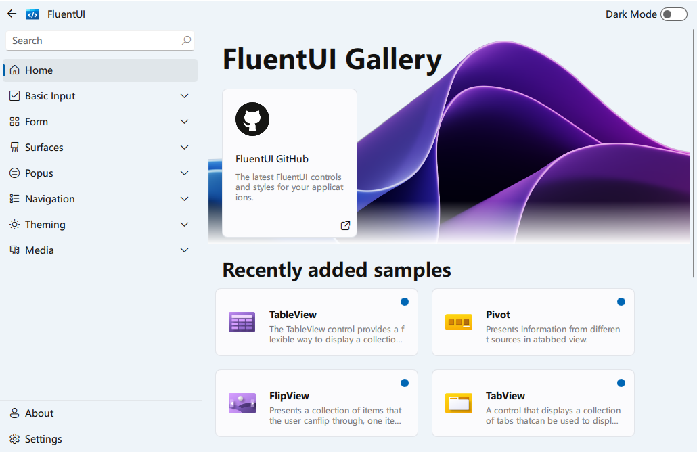
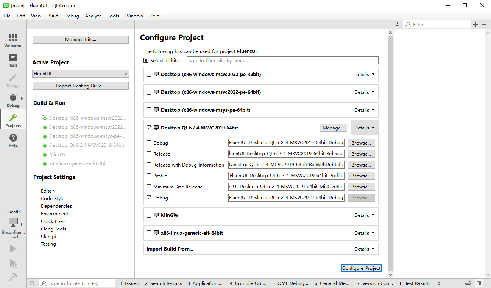
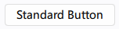
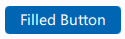
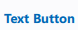
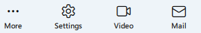
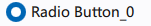
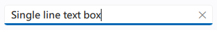
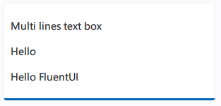
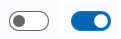

<div align=center>
  
</div>

<h1 align="center">
  QML FluentUI 
</h1>
<p align="center">
  A fluent design component library for Qt QML <a href="https://zhuzichu520.github.io">official wasm app.</a>
</p>

![win-badge] ![ubuntu-badge] ![macos-badge] ![release-badge] ![download-badge] ![download-latest]

<p align="center">
English | <a href="README_zh_CN.md">简体中文</a>
</p>
<div align=center>
  
</div>


[win-link]: https://github.com/zhuzichu520/FluentUI/actions?query=workflow%3AWindows "WindowsAction"
[win-badge]: https://github.com/zhuzichu520/FluentUI/workflows/Windows/badge.svg  "Windows"
[ubuntu-link]: https://github.com/zhuzichu520/FluentUI/actions?query=workflow%3AUbuntu "UbuntuAction"
[ubuntu-badge]: https://github.com/zhuzichu520/FluentUI/workflows/Ubuntu/badge.svg "Ubuntu"
[macos-link]: https://github.com/zhuzichu520/FluentUI/actions?query=workflow%3AMacOS "MacOSAction"
[macos-badge]: https://github.com/zhuzichu520/FluentUI/workflows/MacOS/badge.svg "MacOS"
[release-link]: https://github.com/zhuzichu520/FluentUI/releases "Release status"
[release-badge]: https://img.shields.io/github/release/zhuzichu520/FluentUI.svg?style=flat-square "Release status"
[download-link]: https://github.com/zhuzichu520/FluentUI/releases/latest "Download status"
[download-badge]: https://img.shields.io/github/downloads/zhuzichu520/FluentUI/total.svg "Download status"
[download-latest]: https://img.shields.io/github/downloads/zhuzichu520/FluentUI/latest/total.svg "latest status"


<p align=center>
This is a beautiful FluentUI component library based on Qt QML. Currently the main branch supports Qt 6. If you want to use it in Qt 5, checkout the Qt 5 branch.
</p>

## Requirements

+ Qt Core, Qt Quick, Qt QML, Qt ShaderTool, Qt 5 Compatibility Module. (**Essential**)
+ Qt LinguistTool (optional,for translations)
+ Qt Svg (optional, however essential for Qt 5)

Use [Qt Online Installers](https://download.qt.io/archive/online_installers/) to aquire the moudules (**Recommanded**) or compile them first before using the library.

## ⚽ Get started

+ Download the [pre-built release](https://github.com/zhuzichu520/FluentUI/releases). (Please pecify your platform and compilers.)

+ run `example` program.

or 

+ Clone the repository.

```SHELL
git clone --recursive https://github.com/zhuzichu520/FluentUI.git
```

+ Build

```
git clone --recursive https://github.com/zhuzichu520/FluentUI.git
cd FluentUI
mkdir build
cd build
cmake -DCMAKE_PREFIX_PATH=<YOUR_QT_SDK_DIR_PATH> -DCMAKE_BUILD_TYPE=Release -GNinja <PATH_TO_THE_REPOSITORY>
cmake --build . --config Release --target all --parallel
```

+ Use your IDE (`Qt Creator` or `CLion`) to open the project. (only **CMake** supported).

<div align=center>
  
</div>

+ Compile the project. Then try to execute the `example` demo program.

+ Great! Now you are ready to write your first QML FluentUI program! Check the documentations for more details.


## 📑 Documentations

(Work in progress...🚀)

## Supported components

|Catalog|Detail|Notes / Demos|
|:----:|:----:|:----:|
|FluApp|The initial entry of the program|Router supported(SPA)|
|FluWindow|Frameless Window|*This only works on windows|
|FluAppBar|Title bar on top of the window|Drag, minimize, maximize and close are supported.|
|FluText|Common text||
|FluButton|Common button| |
|FluFilledButton|Filled button||
|FluTextButton|Text button||
|FluToggleButton|Toggle buttons||
|FluIcon|Common icon||
|FluRadioButton|radio button||
|FluTextBox|Single-line input box||
|FluMultiLineTextBox|Multi-lines input area||
|FluToggleSwitch|toggle switch||


View more [`here`](doc/md/all_components.md)!


## Reference
+ [**Windows design**: Design guidelines and toolkits of Microsoft.](https://learn.microsoft.com/en-us/windows/apps/design/)
+ [**Microsoft/WinUI-Gallery**: Microsoft's demo](https://github.com/microsoft/WinUI-Gallery)


## License

This FluentUI library currently licensed under [MIT License](./License)

## ⚡ Visitor count

