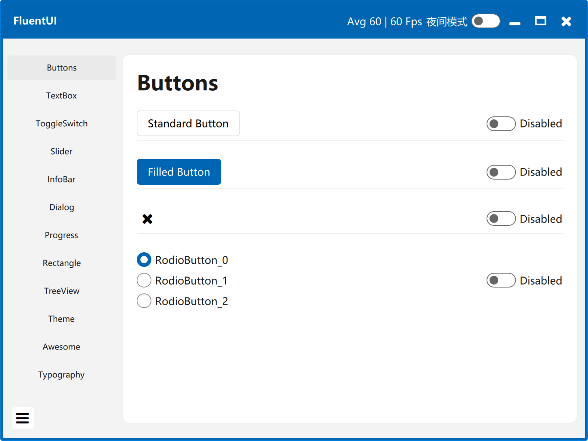
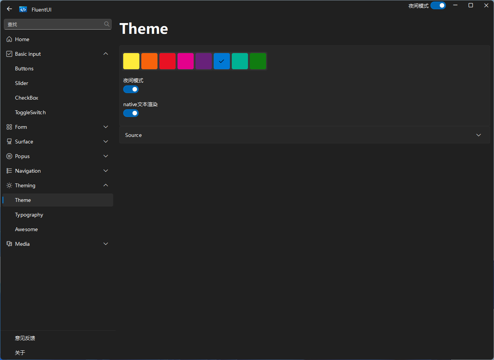
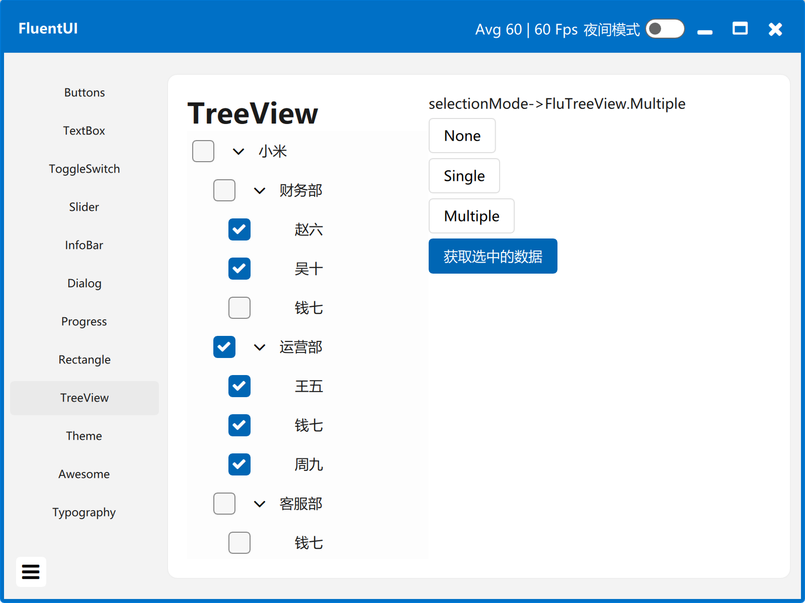
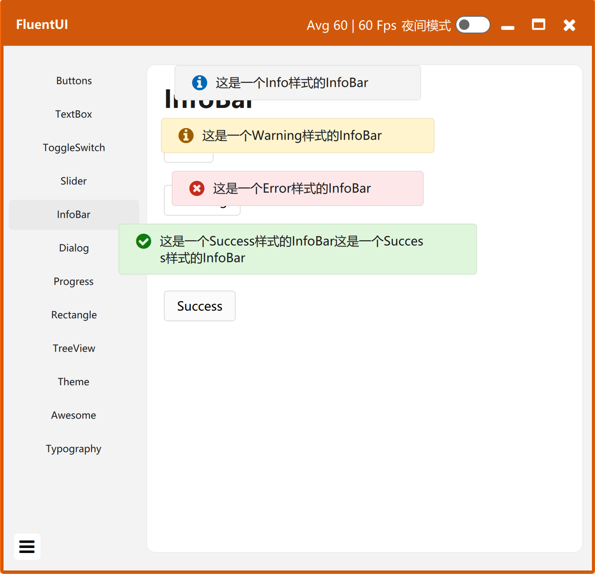
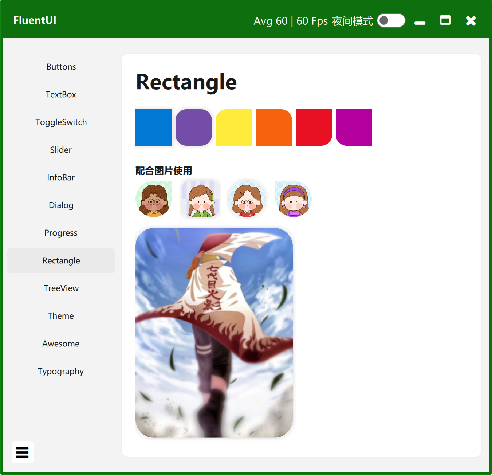

# FluentUI

## 简介

这是一个漂亮的Fluent组件库，使用QML插件开发的

## status
| [Windows][win-link]| [Ubuntu][ubuntu-link]|[MacOS][macos-link]|
|---------------|---------------|-----------------|
| ![win-badge]  | ![ubuntu-badge]      | ![macos-badge] |

[win-link]: https://github.com/zhuzichu520/FluentUI/actions?query=workflow%3AWindows "WindowsAction"
[win-badge]: https://github.com/zhuzichu520/FluentUI/workflows/Windows/badge.svg  "Windows"

[ubuntu-link]: https://github.com/zhuzichu520/FluentUI/actions?query=workflow%3AUbuntu "UbuntuAction"
[ubuntu-badge]: https://github.com/zhuzichu520/FluentUI/workflows/Ubuntu/badge.svg "Ubuntu"

[macos-link]: https://github.com/zhuzichu520/FluentUI/actions?query=workflow%3AMacOS "MacOSAction"
[macos-badge]: https://github.com/zhuzichu520/FluentUI/workflows/MacOS/badge.svg "MacOS"

## 支持的组件

|目录|说明|备注|
|----|----|----|
|FluApp|初始化入口|支持路由跳转|
|FluWindow|无边框窗口|解决windows拖动闪烁问题|
|FluAppBar|窗口顶部标题栏|支持拖动窗口，最小化、最大化、关闭窗口|
|FluText|Text文本||
|FluButton|按钮||
|FluFilledButton|实心按钮||
|FluIconButton|图标按钮||
|FluTextButton|文本按钮||
|FluIcon|图标||
|FluRadioButton|单选按钮||
|FluTextBox|单行输入框||
|FluMultiLineTextBox|多行输入框||
|FluToggleSwitch|开关按钮||
|FluSlider|拖动条||
|FluInfoBar|提示Toast||
|FluContentDialog|对话框||
|FluProgressBar|条形进度条||
|FluProgressRing|圆形进度条||
|FluRectangle|矩形|支持部分圆角、clip|
|FluMenu|菜单框||
|FluTooltip|tooltip提示框||
|FluTreeView|树控件||
|FluTheme|主题设置|支持主题颜色切换，夜间模式|

# 部分效果预览

## 主页

## 主题颜色切换、夜间模式

## FluTreeView树组件

## Toast组件

## Rectangle组件

