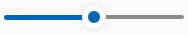
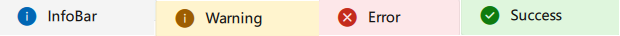
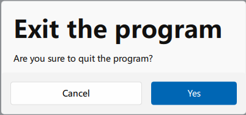
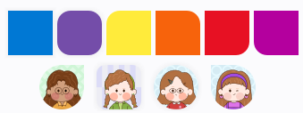
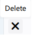
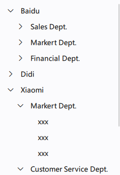

# 支持的组件

|Catalog|Detail|Notes / Demos|
|:----:|:----:|:----:|
|FluApp|The initial entry of the program|Router supported(SPA)|
|FluWindow|Frameless Window|*This only works on windows|
|FluAppBar|Title bar on top of the window|Drag, minimize, maximize and close are supported.|
|FluText|Common text||
|FluButton|Common button| |
|FluFilledButton|Filled button||
|FluTextButton|Text button||
|FluToggleButton|Toggle buttons||
|FluIcon|fluent icons||
|FluRadioButton|radio button||
|FluTextBox|Single-line input box||
|FluMultiLineTextBox|Multi-lines input area||
|FluToggleSwitch|toggle switch||
|FluSlider|Slider||
|FluInfoBar|提示Toast||
|FluContentDialog| dialog ||
|FluProgressBar| progress bar ||
|FluProgressRing|circle progress||
|FluRectangle|reactangle|  *partially support `round` and `clip` feature|
|FluMenu|menu||
|FluTooltip|tooltip||
|FluTreeView|tree view component||
|FluTheme|theme settings|theme color changes, dark mode are supported|
|FluCarousel|-||
|FluTimePicker| time picker ||
|FluDatePicker|date picker||
|FluMenu|the menu popup||
|FluNavigationView|responsive navigation view||
|FluScrollbar|scroll bar||
|FluPagination|||
|FluTableView|table component||
|FluMediaPlayer|multimedia components||
|FluFlipView| flip view||